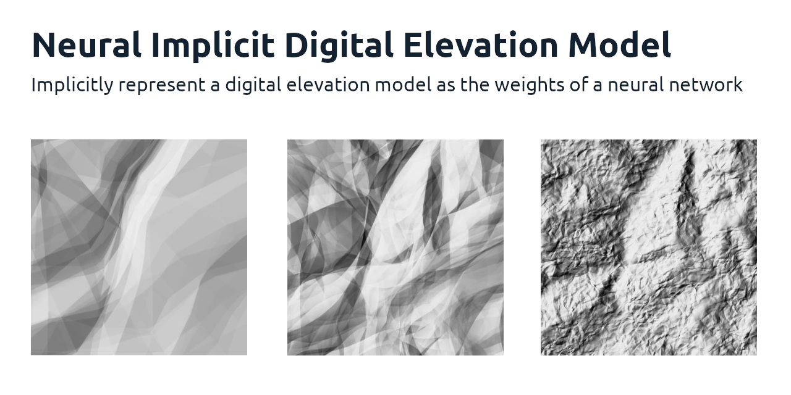

# Neural Implicit Digital Elevation Model

We fit a neural network on a digital elevation model; we can reconstruct the digital elevation model by using the learned weights to predict elevation for every coordinate.

Benefits
- Flexible up/down scaling of the model's parameters to increase/decrease details
- Weighted sampling during training to focus on details in regions of interest

Examples, with a very small neural net (~15k parameters), 2k iterations, and different [fourier feature](https://arxiv.org/abs/2006.10739) scales

See [this issue](https://github.com/daniel-j-h/nedem/issues/2) for the respective training videos.

Note: this project is experimental and a playground for me to learn Jax/Flax, neural implicits, and fourier features.

## Dataset

We use the [Copernicus GLO-30](https://registry.opendata.aws/copernicus-dem/) digital elevation model for experiments.

    aws s3 cp s3://copernicus-dem-30m/Copernicus_DSM_COG_10_N46_00_E008_00_DEM/Copernicus_DSM_COG_10_N46_00_E008_00_DEM.tif . --no-sign-request

## Quadkeys

We work with quadkey tifs as the unit of abstraction.

    rio warp in.tif 3857.tif --dst-crs EPSG:3857
    rio bounds 3857.tif | mercantile tiles 10 > z10.txt

    while read tile; do
      rio clip 3857.tif $(mercantile quadkey "$tile").tif --with-complement --bounds "$(mercantile shapes --extents --mercator "$tile")"
    done < z10.txt

This will warp and cut the raster tifs into quadkeys like `1202213002.tif`.

## Training

You will need docker, docker-compose, and the nvidia-docker plugin set up to run training on a GPU.

We provide a self-contained and reproducible development environment with the correct drivers, versions, and dependencies.

    make
    make sh

To fit a neural net on the quadkey `1202213002.tif`, in the self-contained development environment run

    ./main.py data/1202213002.tif

## Hillshade

The digital elevation model is best visualized as a hillshaded tif; you can use `gdaldem` from `gdal-bin` for hill shading

    for p in step-*.tif; do gdaldem hillshade $p -multidirectional hillshade-$p ; done

The model fitting happens over multiple steps; you can use `ffmpeg` to animate the hill shaded tifs

    ffmpeg -y -loglevel error -r 15 -f image2 -pattern_type glob -i "hillshade-step-*.tif" -vf 'crop=w=512:h=512' -c:v libx264 -crf 23 -profile:v high -preset veryslow -pix_fmt yuv420p -movflags faststart hillshade-step.mp4

## References

- https://arxiv.org/abs/2009.09808
- https://arxiv.org/abs/2006.10739
- https://registry.opendata.aws/copernicus-dem/

## License

Copyright © 2022 Daniel J. Hofmann

Distributed under the MIT License (MIT).
